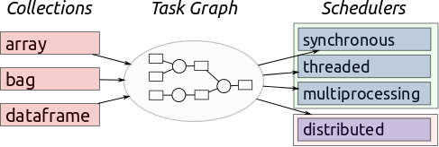
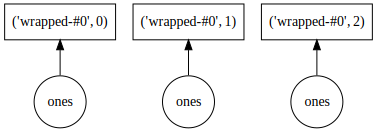
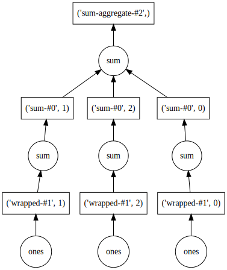
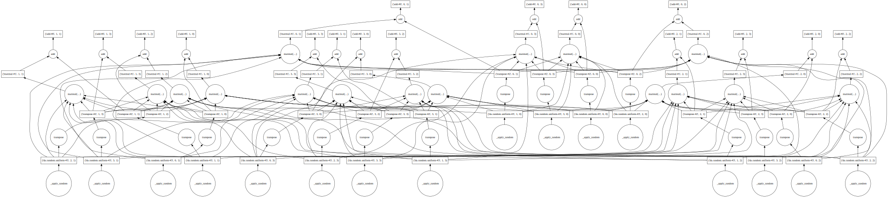
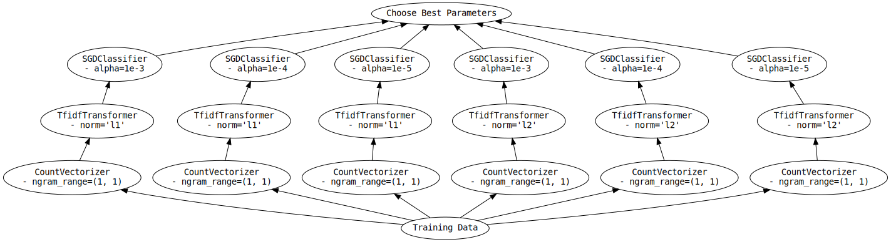
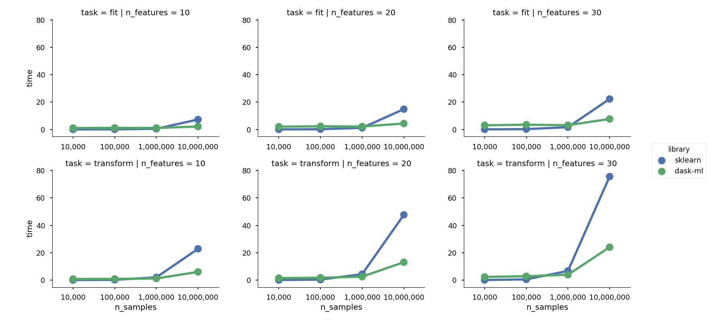

class: center, middle, title

# Scalable Computing with Dask


---

class: center, middle, title

# Hi, I'm Tom

I work at Anaconda

---

# Goal

*Scale scientific Python to larger datasets and larger problems*
--

# Strategy

- Use a task graph of delayed function calls to reason about parallelism
- Use and improve existing ecosystem to compute the tasks

---

class: center, middle, title

# Dask Coordinates

---

# Dask Coordinates

- breaks large problems in to smaller tasks...

--

- ... to be executed by NumPy, pandas, Python, ...

--

- ... in parallel, using `{threads, processes, machines}`

---

# dask.dataframe


---

# dask.array


---

# Collections / Schedulers



- **Collections**: build task graphs with famliliar APIs
- **Task Graph**: dask's chance to reason about parallelism
- **Scheduler**: execute a task graph, producing a concrete result

---

class: center, middle, title

# Collections

*Familiar API for building tasks graphs*

---

# Familiar API



```python
import numpy as np

>>> x = np.ones(15)
>>> x
array([1., 1., 1., 1., 1., 1., 1., 1., 1., 1., 1., 1., 1., 1., 1.])

>>> y = da.ones(15, chunks=5)
>>> y
dask.array<wrapped, shape=(15,), dtype=float64, chunksize=(5,)>
```

---

# Familiar API



```python
>>> y.sum()
dask.array<sum-aggregate, shape=(), dtype=float64, chunksize=()>
```

---

# Familiar API



```python
>>> X = da.random.uniform(size=(10, 10), chunks=3)
>>> ((X.T @ X) + X.T)
dask.array<add, shape=(10, 10), dtype=float64, chunksize=(3, 3)>
```

---

class: center, middle, title

# Schedulers

---

# Schedulers

  

- Execute task graphs
- `threaded`
  - Good for GIL-releasing tasks (NumPy, Pandas)
  - No serialization overhead
- `multiprocessing`
- `distributed`

---

class: center, middle, title

# *Dask Demo*

---

class: center, middle, title

# dask-ml

---

# dask-ml


1. Collection of experiements into a single package
    - `dask-searchcv`
    - `dask-glm`
    - `distributed.joblib`
    - ...
2. Wrappers for scikit-learn Incremental Estimators
3. Reimplement estimators to work on dask collections
    - `KMeans`
    - parts of `preprocessing`
    - parts of `linear_model`
    - `SpectralClustering`

---

# Intelligent Hyperparameter Search

Work done by Jim Crist

```python
from sklearn.feature_extraction.text import CountVectorizer
from sklearn.feature_extraction.text import TfidfTransformer
from sklearn.linear_model import SGDClassifier
from sklearn.pipeline import Pipeline

pipeline = Pipeline([('vect', CountVectorizer()),
                     ('tfidf', TfidfTransformer()),
                     ('clf', SGDClassifier())])

grid = {'vect__ngram_range': [(1, 1)],
        'tfidf__norm': ['l1', 'l2'],
        'clf__alpha': [1e-3, 1e-4, 1e-5]}
```

---

# Intelligent Hyperparameter Search

*scikit-learn*




*Use `memory=` to avoid recomputation.*

---

# Intelligent Hyperparameter Search

*dask-ml*


---

# Distributed Linear Models

```python
from dask_ml.linear_model import LogisticRegression

clf = LogisticRegression()
clf.fit(X, y)
```

- Uses a distributed solver implemented in `dask-glm`.
- [Task stream](figures/dask-glm-proximal-grad-large.html)

---

class: center, middle, title

# Re-implement Estimators

---

# An Example: `QuantileTransformer`

```diff
diff --git a/transform-sklearn.py b/transform-dask.py
index 3fa61e6..79569a3 100644
--- a/transform-sklearn.py
+++ b/transform-dask.py
@@ -1,6 +1,5 @@
     def _transform_col(self, X_col, quantiles, inverse):
@@ -20,13 +19,12 @@
             lower_bound_y = quantiles[0]
             upper_bound_y = quantiles[-1]
             #  for inverse transform, match a uniform PDF
-            X_col = output_distribution.cdf(X_col)
+            X_col = X_col.map_blocks(output_distribution.cdf)
         # find index for lower and higher bounds
```

---

# An Example: `QuantileTransformer`

```diff
         X_col[upper_bounds_idx] = upper_bound_y
         X_col[lower_bounds_idx] = lower_bound_y
         # for forward transform, match the output PDF
         if not inverse:

-            X_col = np.clip(X_col, clip_min, clip_max)
+            X_col = da.clip(X_col, clip_min, clip_max)

         return X_col
```

---

# An Example: `QuantileTransformer`



---

# A Complex Example: k-Means

- `k-means++` is not "scalable"
- Implemented `k-means||` (the default in spark)

???
Show ~/sandbox/scalable-ml/k-means||.ipynb

---

# Thanks!

- [https://dask.pydata.org](https://dask.pydata.org)
- [https://dask-ml.readthedocs.io](https://dask-ml.readthedocs.io)
