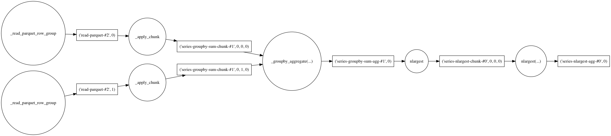
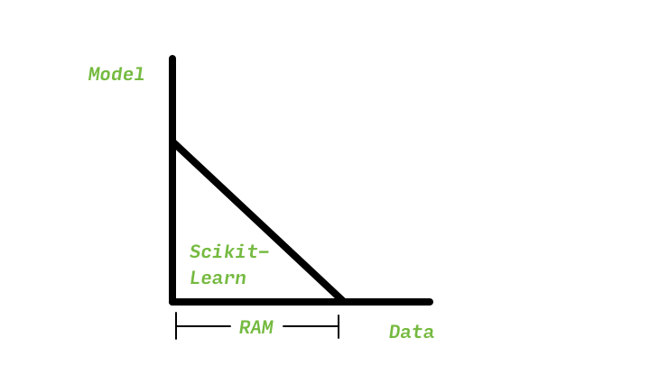
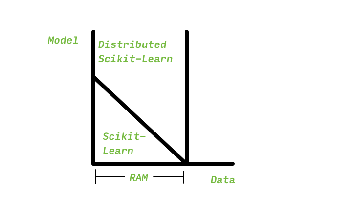
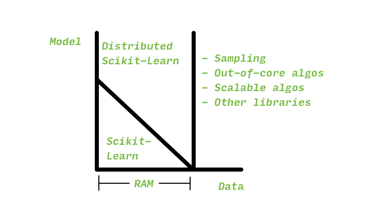
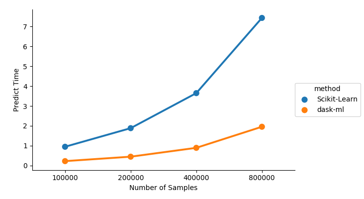

class: center, middle, title

# Scalable Machine Learning with Dask


---

# Motivation

- Context: Python is great for data analysis
- Problem: "It doesn't scale"
- Goal: Enable machine learning on larger datasets and larger problems

---

# Context

- Great libraries for data analytics, but
- NumPy and pandas are essentially limited to a single thread
- Scikit-learn is essentially limited to a single machine

---

class: center, middle, title

# Dask

(In 3 minutes)

???
Brief (5 minute) introduction to what dask provides before onto `dask-ml`.

---

# Dask

- Familiar API for large datasets
- Parallel, distributed computation

???
Dask provides users with containers to manipulate large datasets using
a pandas- or NumPy-like API.

Dask provides schedulers to manage parallelism.

---

# Familiar API for Large Datasets

```python
In [1]: import dask.dataframe as dd

In [2]: indiv = dd.read_parquet("data/indiv-*.parq/")

In [3]: total_by_employee = (
   ...:     indiv.groupby('employer')
   ...:         .transaction_amt.sum()
   ...:         .nlargest(10)
   ...: )

In [4]: total_by_employee
Out[4]:
Dask Series Structure:
npartitions=1
    int64
      ...
Name: transaction_amt, dtype: int64
Dask Name: series-nlargest-agg, 110 tasks
```

---

# Familiar API for Large Datasets

```python
*In [1]: import dask.dataframe as dd

*In [2]: indiv = dd.read_parquet("data/indiv-*.parq/")

In [3]: total_by_employee = (
   ...:     indiv.groupby('employer')
   ...:         .transaction_amt.sum()
   ...:         .nlargest(10)
   ...: )

In [4]: total_by_employee
Out[4]:
Dask Series Structure:
npartitions=1
    int64
      ...
Name: transaction_amt, dtype: int64
*Dask Name: series-nlargest-agg, 110 tasks
```

---

# Dask Collections Build Task Graphs




- Results aren't computed immediately
- dask's schedulers `compute` graphs in parallel on many threads, processes, or machines

---

# Familiar API for Large Datasets

```python
In [5]: total_by_employee = (
   ...:    indiv.groupby('employer')
   ...:        .transaction_amt.sum()
   ...:        .nlargest(10)
   ...:)


In [6]: avg_by_occupation = (
   ...:     indiv.groupby("occupation")
   ...:         .transaction_amt.mean()
   ...:         .nlargest(10)
   ...: )
   
In [7]: results = dask.compute(total_by_employee,
  ...:                        avg_by_occupation)
```

---

class: center, middle

Dask Schedulers Execute Task Graphs

<video src="figures/compute-many.webm" width=50% autoplay controls loop/>

---

class: center, middle

We have a container for our data

<hr>

We want to model it

---

class: center, middle, title

# Dask-ML

scalable machine learning

---

# Dask-ML

- Estimators and utilities for machine learning
- Builds on Dask

  * Dask arrays and dataframes for large datasets
  * Dask cluster for distributed computation
  * Flexible task scheduling for sophisticated algorithms
  
---

class: center, middle, title

# Dimensions of Scale

CPU Bound / RAM Bound

---

# Dimensions of Scale



---

# Dimensions of Scale: CPU Bound




---

# Dimensions of Scale: RAM Bound



---

# Fitting Large Models

1. You have an ensemble of many estimators
2. You have many hyper-parameters
  
???
This section shows `dask_ml.joblib`, how to use your `dask.distributed` cluster
to fit a regular scikit-learn model on an dataset that fits in memory. This uses
all the nodes on your cluster to do the individual tasks inside scikit-learn.

---

# Distributed Scikit-Learn: Joblib

- Each worker gets a copy of the data
- Tasks parallelized by `n_jobs`

```python
from sklearn.externals import joblib
from dask.distributed import Client

client = Client('scheduler-address')
clf = RandomForstClassifier(n_estimators=200, n_jobs=-1)

with joblib.parallel_backend("dask", scatter=[X, y]):
    clf.fit(X, y)
```

---

class: center, middle

Distributed Scikit-Learn: Joblib

<video src="figures/distributed-joblib-cluster.webm" width=50% autoplay controls loop>
</video>


???
This video shows the distributed UI while fitting a `RandomForstClassifier` with
200 trees. Each tree is an individual task. Fitting the 200 trees is an
embarrassingly parallel job, and can be done across the cluster.

---

# Parallel Post-Fitting Tasks

Train on a small dataset normally

```python
In [1]: from sklearn.svm import SupportVectorClassifier
   ...: from dask_ml.wrappers import ParallelPostFit
   ...:
   ...: clf = ParallelPostFit(SupportVectorClassifier())
   ...:
   ...: X, y = make_classification(n_samples=100_000, chunks=10_000)
   ...:
   ...: clf.fit(X, y)
```

---

# Parallel Post-Fitting Tasks


Transform / Predict in parallel

```python
In [2]: clf.predict_proba(X)
Out[2]: dask.array<predict_proba, shape=(100000, 2),
                   dtype=float64, chunksize=(10000, 2)>

In [3]: clf.predict_proba(X).compute()
Out[3]:
array([[0.03456433, 0.96543567],
       [0.01632352, 0.98367648],
       [0.16356299, 0.83643701],
       ...,
       [0.0150388 , 0.9849612 ],
       [0.98526749, 0.01473251],
       [0.01522759, 0.98477241]])
```

---

# Parallel Post-Fitting Tasks



---

class: center, middle, title

# Distributed Estimators

*For training on large datasets*

???
For when you want to train on a larger-than-memory dataset.

---

# Distributed Systems


```python
import dask_ml.tensorflow

tf_net, dask_net = dask_ml.tensorflow.start_tensorflow(client)
```


```python
import dask_ml.xgboost

xgb = dask_ml.xgboost.train(X, y)
```

---

# Distributed Estimators

- `KMeans`
- `SpectralClustering`
- `linear_models`

---

# Thanks!

- http://dask-ml.readthedocs.io/en/latest/
- https://github.com/dask/dask-ml
