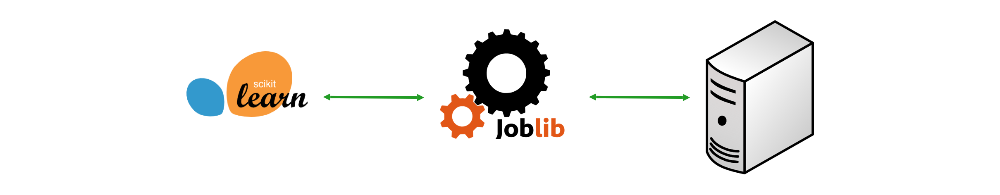
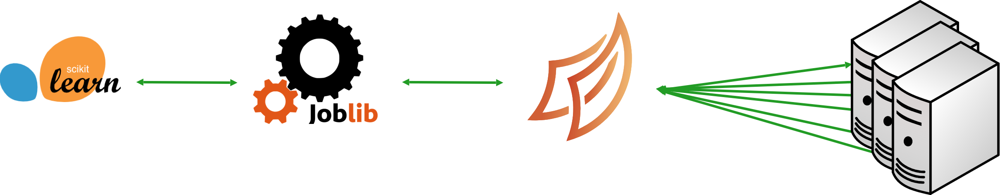

class: center, middle, title

# Scalable Machine Learning with Dask


---

# Motivation

- Context: Python is great for data analysis
- Problem: "It doesn't scale"
- Goal: Enable machine learning on larger datasets and larger problems

???
Python has a rich ecosystem of libraries for data analysis.
Some are under the impression that it "doesn't scale" (GIL, not "production-ready", etc.).
Dask is attempting to solve this for a wide class of problems.
Dask-ML is focused on scalable machine learning.

---

class: center, middle, title

# Dask

(In 3 minutes)

???
Brief (5 minute) introduction to what dask provides before onto `dask-ml`.

---

# Dask


* Familiar API...

* for working with large datasets...

* in parallel using many threads / processes / machines


???
Dask provides users with containers to manipulate large datasets using
a pandas- or NumPy-like API.

Dask provides schedulers to manage parallelism.

---

# Familiar API for Large Datasets

```python
In [1]: import dask.dataframe as dd

In [2]: indiv = dd.read_parquet("data/indiv-*.parq/")

In [3]: total_by_employee = (
   ...:     indiv.groupby('employer')
   ...:         .transaction_amt.sum()
   ...:         .nlargest(10)
   ...: )

In [4]: total_by_employee
Out[4]:
Dask Series Structure:
npartitions=1
    int64
      ...
Name: transaction_amt, dtype: int64
Dask Name: series-nlargest-agg, 110 tasks
```

---

# Familiar API for Large Datasets

```python
*In [1]: import dask.dataframe as dd

*In [2]: indiv = dd.read_parquet("data/indiv-*.parq/")

In [3]: total_by_employee = (
   ...:     indiv.groupby('employer')
   ...:         .transaction_amt.sum()
   ...:         .nlargest(10)
   ...: )

In [4]: total_by_employee
Out[4]:
Dask Series Structure:
npartitions=1
    int64
      ...
Name: transaction_amt, dtype: int64
*Dask Name: series-nlargest-agg, 110 tasks
```

---

# Dask Collections Build Task Graphs


- Results aren't computed immediately
- dask's schedulers `compute` graphs in parallel on many threads, processes, or machines

---

# Schedulers Execute Task Graphs


* Execute items in parallel
* Execute using many threads / processes / machines

---

# Dask Summary

1. Write familiar NumPy / pandas / scikit-learn code
2. A task graph is built
3. Task graph is executed in parallel, producing a concrete result

---

class: center, middle, title

# Dask-ML

scalable machine learning

---

# Dask-ML

- Estimators and utilities for machine learning
- Builds on Dask

  * Dask arrays and dataframes for large datasets
  * Dask cluster for distributed computation
  * Flexible task scheduling for sophisticated algorithms
  
---

class: center, middle, title

# Dimensions of Scale

CPU Bound / RAM Bound

---

# Dimensions of Scale


---

# Dimensions of Scale: CPU Bound


---

# Dimensions of Scale: RAM Bound


---

class: center, middle, title

# Distributed Scikit-Learn

For CPU-Bound Problems

---

# Distributed Scikit-Learn

- Dask provides the cluster computing
- NumPy for arrays (full dataset fits in each worker's memory)
- Scikit-Learn provides the estimators

---

# Scikit-Learn

```python
from sklearn.svm import SVR
from sklearn.model_selection import GridSearchCV
# ...
# ...

est = GridSearchCV(SVR(), param_grid, n_jobs=-1)


est.fit(X, y)
```



---

# Scikit-Learn (Distributed)


```python
from sklearn.svm import SVR
from sklearn.model_selection import GridSearchCV
from sklearn.externals import joblib
import dask_ml.joblib

est = GridSearchCV(SVR(), param_grid, n_jobs=-1)

with joblib.parallel_backend("dask", scatter=[X, y]):
    est.fit(X, y)
```



---

class: center, middle

Distributed Scikit-Learn

<iframe src="https://drive.google.com/file/d/1ZR_1e1_9VMpa7dKGlI5YmW-pD9UpQ0cx/preview" width="888" height="500" allowfullscreen="true" webkitallowfullscreen="true" mozallowfullscreen="true"></iframe>

???
Distributed Grid Search


---

class: center, middle, title

# Distributed Training

For RAM-bound problems

---

# Caveat: Distributed ML is complex

* Do you need all the data?
  - Plot a learning curve. Sample your data.
* Do you need all the data *for training*?
  - `dask_ml` easily parallelizes predict, score, etc. for any estimator.

---

# Distributed Training

Two Options:

1. Dask-ML's `Incremetnal` + Scikit-Learn's `partial_fit`
2. Dask-ML re-implements some estimators

---

# `partial_fit`

- Scikit-Learn supports incremental learning with `partial_fit`
- Estimators train on blocks of data
- Dask's collections are already blocked!

---

# `partial_fit`

```python
from sklearn.linear_model import SGDClassifier
# ...

clf = SGDClassifier()

for X, y in data_stream:
    clf.partial_fit(X, y)
```

---

# `Incremental + partial_fit`

```python
from sklearn.linear_model import SGDClassifier
from dask_ml.wrappers import Incremental

clf = SGDClassifier()
inc = Incremental(clf, scoring='accuracy')
inc.fit(X_big, y_big)
```

---

# `Incremental + partial_fit`

- Distributes any estimator implementing `partial_fit`
- Training is distributed, but sequential
- Can be used with within `Pipeline`, `GridSearchCV` for parallelism

---

class: center, middle, title

# Distributed Estimators

---

# Distributed Estimators

Dask-ML re-implements *some* algorithms

* Generalized Linear Models
  * `LogisticRegression`, `LinearRegression`, ...
* Clustering 
  * `KMeans(init='k-means||')`, `SpectralClustering`, ...
* Preprocessing
  * `QuantileTransformer`, `RobustScalar`, ...
* Dimensionality Reduction
  * `PCA`, `TruncatedSVD`
* ...

---

class: center

## Distributed K-Means

<iframe src="https://drive.google.com/file/d/1lxVB4q1T9Omd0Prcwjv5kQxDwh6AY0F4/preview" width="888" height="500" allowfullscreen="true" webkitallowfullscreen="true" mozallowfullscreen="true"></iframe>

---

# Thanks!

- https://dask.pydata.org
- https://dask-ml.readthedocs.io/en/latest/
- https://github.com/dask/dask-ml
