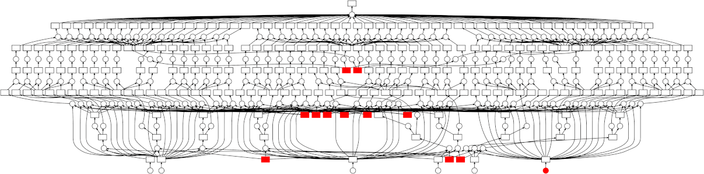
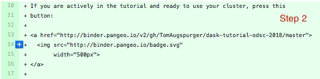

class: center, middle, title

# Cloud Native Data Science with Dask


---

# Hi, I'm Tom


https://git.io/fxNxT, or

https://github.com/TomAugspurger/dask-tutorial-odsc-2018

I work at Anaconda on Dask and Pandas

---

# Dask's Motivation

- Context: Python is great for data analysis

---

background-image: url(figures/numeric-python-ecosystem.png)

---

# Dask's Motivation

- Context: Python is great for data analysis
- Problem: "It doesn't scale"
  + NumPy is mostly in-memory, mostly single-threaded
  + Pandas is in-memory, mostly single-threaded
- Goal: Scale scientific Python to larger problems

---

class: split-40

# Dask's Strategy

.column[
- Operations expressed as a DAG of tasks
- Schedulers execute graphs in parallel
- Use NumPy / Pandas, etc. in memory
]
.column[
<br><br>

]

---


class: center, middle, title

# Cloud Native

---

# Cloud Native is Many Things

**Goals**

1. Easily reproducible, sharable, & remixable analyses (containers)
2. Easily compose pieces together (standard APIs between components)
3. Easily scale: Dynamic Orchestration

---

# This Deployment

- Everyone gets
  1. Live, runnable notebook with code examples and exercises
  2. Compute resources for a personal Dask Cluster
- Scale from 1 user to 100s
- Customize for alternative deployements

---

# This Deployment




---

class: center, middle, title

# This Deployment: BinderHub + Pangeo

---

# BinderHub = Repo2Docker + JupyterHub

- Git repository specifies dependencies, artifacts
- Repo2Docker builds and registers an image
- JupyterHub for auth / single-user servers
- Deployable with helm

---

# BinderHub Example

**Configure**

```yaml
binderhub:
  jupyterhub:
    hub:
      services:
        binder:
          apiToken: "<binder-token>"
    singleuser:
      image:
        daskdev/dask-notebook
```

**Deploy**

```yaml
$ helm install jupyterhub/binderhub ... -f secret.yaml -f config.yaml
```

**Docs** https://binderhub.readthedocs.io/en/latest/index.html

---

# MyBinder

<iframe src="https://mybinder.org" width="80%" height="80%"></iframe>

---

# Pangeo

- Pangeo (https://pangeo.io)
  + "Community platform for Big Data geoscience"
  + NSF, NASA, & Sloan Foundation-funded project
  + Providing the compute resources
  + https://github.com/pangeo-data/pangeo-binder
- `pangeo-binder`
  + BinderHub deployment configured to attach to a Dask Cluster

```bash
helm install pangeo-binder ... -f binder_config.yml -f binder_secret.yaml
```

---

# Deploying Dask

- Kubernetes (via helm or natively)
- YARN / Hadoop
- HPC
- https://docs.dask.org/en/latest/setup.html

---

# Thanks

- https://dask.org
- https://docs.dask.org
- https://ml.dask.org
- https://pangeo.io
