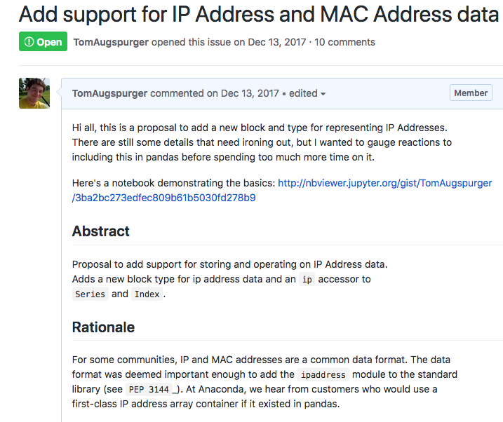

class: title

# Getting Started in Open Source

The why and the how.

---

# Hi, I'm Tom

I work at Anaconda, Inc.

We sell [Anaconda Enterprise](https://www.anaconda.com/enterprise/).

We support open source.

---

class: center, middle

# Contributing to Open Source

Why & How

---

class: title

# Why Contribute?

---

# The community

---

# Learn from others

---

# Influence projects you care about

---

# Résumé

---

class: title

# Why not Contribute?

---

# The Community (Again)

> Shut up, Mauro. And I don't _ever_ want to hear that kind of obvious
> garbage and idiocy from a kernel maintainer again. Seriously.
>
> ~ Linus Torvalds

---

# You have other things to do

---

class: title

# The How

Ways to Contribute

---

# Community Building

- Stack Overflow & mailing lists
- Blogging posts & conference talks

---

# Bug reports

This is an under-appreciated skill

- https://matthewrocklin.com/blog/work/2018/02/28/minimal-bug-reports
- https://stackoverflow.com/help/mcve

---

# Documentation & code

- New users uniquely positioned to write docs
- Easier to see APIs that are unintuitive

---

class: title

# Where to Start

---

# Find an Interesting Topic

---

# Find an Issue

---

# Contributing Guides

- http://pandas.pydata.org/pandas-docs/stable/contributing.html
- https://docs.djangoproject.com/en/dev/internals/contributing/

---

# An Example

https://github.com/pandas-dev/pandas/issues/19209
